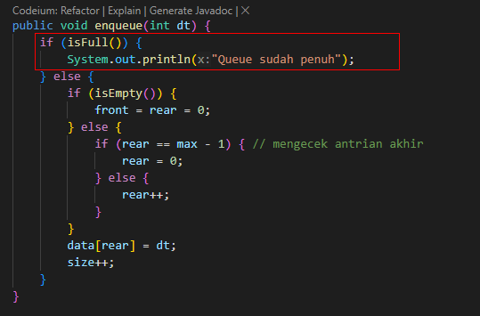

# Algoritma dan Struktur Data

Vira Alfita Yunia

TI-1B

29

2341720055

## Pertemuan 10 (Queue)

### Percobaan 1

Kode program

Queue.java

    public class Queue29 {
        int[] data;
        int front;
        int rear;
        int size;
        int max;

        public Queue29(int n) {
            max = n;
            data = new int[max];
            size = 0;
            front = rear = -1;
        }

        public boolean isEmpty() {
            if (size == 0) {
                return true;
            } else {
                return false;
            }
        }

        public boolean isFull() {
            if (size == max) {
                return true;
            } else {
                return false;
            }
        }

        public void peek() {
            if (!isEmpty()) {
                System.out.println("Elemen terdepan : " + data[front]);
            } else {
                System.out.println("Queue masih kosong");
            }
        }

        public void print() {
            if (isEmpty()) {
                System.out.println("Queue masih kosong");
            } else {
                int i = front;
                while (i != rear) {
                    System.out.println(data[i] + " ");
                    i = (i + 1) % max;
                }
                System.out.println(data[i] + " ");
                System.out.println("Jumlah elemen = " + size);
            }
        }

        public void clear() {
            if (!isEmpty()) {
                front = rear = -1;
                size = 0;
                System.out.println("Queue berhasil dikosongkan");
            } else {
                System.out.println("Queue masih kosong");
            }
        }

        public void enqueue(int dt) {
            if (isFull()) {
                System.out.println("Queue sudah penuh");
                System.exit(0);
            } else {
                if (isEmpty()) {
                    front = rear = 0;
                } else {
                    if (rear == max - 1) {
                        rear = 0;
                    } else {
                        rear++;
                    }
                }
                data[rear] = dt;
                size++;
            }
        }

        public int dequeue() {
            int dt = 0;
            if (isEmpty()) {
                System.out.println("Queue masih kosong");
                System.exit(dt);
            } else {
                dt = data[front];
                size--;
                if (isEmpty()) {
                    front = rear = -1;
                } else {
                    if (front == max - 1) {
                        front = 0;
                    } else {
                        front++;
                    }
                }
            }
            return dt;
        }
    }

QueueMain.java

    import java.util.Scanner;

    public class QueueMain29 {
    public static void menu() {
    System.out.println("Masukkan operasi yang diinginkan: ");
    System.out.println("1. Enqueue");
    System.out.println("2. Dequeue");
    System.out.println("3. Print");
    System.out.println("4. Peek");
    System.out.println("5. Clear");
    System.out.println("-----------------------");
    }

        public static void main(String[] args) {
            Scanner scan29 = new Scanner(System.in);

            System.out.print("Masukkan kapasitas queue: ");
            int n = scan29.nextInt();

            Queue29 q = new Queue29(n);

            int pilih;
            do {
                menu();
                pilih = scan29.nextInt();

                switch (pilih) {
                    case 1:
                        System.out.print("Masukkan data baru: ");
                        int dataMasuk = scan29.nextInt();
                        q.enqueue(dataMasuk);
                        break;

                    case 2:
                        int dataKeluar = q.dequeue();
                        if (dataKeluar != 0) {
                            System.out.println("Data yang keluar: " + dataKeluar);
                            break;
                        }

                    case 3:
                        q.print();
                        break;

                    case 4:
                        q.peek();
                        break;

                    case 5:
                        q.clear();
                        break;

                    default:
                        break;

                }

            } while (pilih == 1 || pilih == 2 || pilih == 3 || pilih == 4 || pilih == 5);

            scan29.close();
        }

    }

Hasil ketika dijalankan

#### Pertanyaan

<strong>
Pada konstruktor, mengapa nilai awal atribut front dan rear bernilai -1, sementara atribut size
bernilai 0?
</strong>

Karena nilai awal dari index sebuah array adalah 0, maka dari itu front dan rear bernilai -1 yang menandakan bahwa kondisi awal queue dimulai dari index ke -1. Sementara atribut size bernilai 0 karena panjang sebuah array awal yang kosong akan selalu bernilai 0.

<strong>
Pada method Enqueue, jelaskan maksud dan kegunaan dari potongan kode berikut!
</strong>

Hal ini menciptakan siklus dalam penggunaan array untuk representasi antrian, di mana ketika rear mencapai batas maksimum array, penambahan elemen baru akan kembali dimulai dari awal array, memanfaatkan ruang kosong yang mungkin ada setelah penghapusan elemen dari antrian.

<strong>
Pada method Dequeue, jelaskan maksud dan kegunaan dari potongan kode berikut!
</strong>

Hal ini terjadi ketika kita sudah menambahkan dan menghapus elemen dari antrian sebelumnya. Pada saat operasi penghapusan dilakukan lagi, kita periksa apakah kita sudah sampai ke ujung array. Jika ya, itu berarti tidak ada ruang di belakang dalam array untuk mengambil elemen lagi, tapi masih ada elemen di depan yang perlu diambil jika antriannya berputar. Jadi, dengan mengatur ulang indeks front ke 0, kita bisa membuat antrian berputar kembali dan memanfaatkan ruang yang tersedia di depan.

<strong>
Pada method print, mengapa pada proses perulangan variabel i tidak dimulai dari 0 (int i=0), melainkan int i=front?
</strong>

Karena pada queue nilai paling awal tidak selalu pada index ke-0, sehingga untuk mengatasi hal tersebut kita menggunakan front sebagai index awal

<strong>
Perhatikan kembali method print, jelaskan maksud dari potongan kode berikut!
</strong>

Kode tersebut digunakan untuk menggeser indeks elemen dalam antrian. Setiap kali terjadi perulangan, indeks 'i' akan bertambah satu, dan jika sudah mencapai nilai maksimum yang ditentukan maka akan kembali ke indeks awal antrian dengan menggunakan operasi modulus (%), sehingga memungkinkan antrian untuk terus berputar dengan ruang yang sama tanpa melampaui batas maksimum.

<strong>
Tunjukkan potongan kode program yang merupakan queue overflow!
</strong>

<strong>
Pada saat terjadi queue overflow dan queue underflow, program tersebut tetap dapat berjalan dan hanya menampilkan teks informasi. Lakukan modifikasi program sehingga pada saat terjadi queue overflow dan queue underflow, program dihentikan!
</strong>

Untuk menjalankan studi kasus di atas perlu dilakukan modifikasi pada class enqueue dan dequeue

Class enqueue setelah dimodifikasi

    public void enqueue(int dt) {
        if (isFull()) {
            System.out.println("Queue sudah penuh");
            System.exit(0);
        } else {
            if (isEmpty()) {
                front = rear = 0;
            } else {
                if (rear == max - 1) {
                    rear = 0;
                } else {
                    rear++;
                }
            }
            data[rear] = dt;
            size++;
        }
    }

Class dequeue setelah dimodifikasi

    public int dequeue() {
        int dt = 0;
        if (isEmpty()) {
            System.out.println("Queue masih kosong");
            System.exit(dt);
        } else {
            dt = data[front];
            size--;
            if (isEmpty()) {
                front = rear = -1;
            } else {
                if (front == max - 1) {
                    front = 0;
                } else {
                    front++;
                }
            }
        }
        return dt;
    }

Hasil ketika dijalankan

Overflow

Underflow

### Percobaan 2

Kode program

Nasabah29.java

    package Pertemuan10.Praktikum2;

    public class Nasabah29 {
        String nama, norek, alamat;
        int umur;
        double saldo;

        public Nasabah29() {

        }

        public Nasabah29(String nama, String norek, String alamat, int umur, double saldo) {
            this.nama = nama;
            this.norek = norek;
            this.alamat = alamat;
            this.umur = umur;
            this.saldo = saldo;
        }

        public static class Queue29 {
            Nasabah29[] data;
            int front;
            int rear;
            int size;
            int max;

            public Queue29(int n) {
                max = n;
                data = new Nasabah29[max];
                size = 0;
                front = rear = -1;
            }

            public boolean isEmpty() {
                if (size == 0) {
                    return true;
                } else {
                    return false;
                }
            }

            public boolean isFull() {
                if (size == max) {
                    return true;
                } else {
                    return false;
                }
            }

            public void peek() {
                if (!isEmpty()) {
                    System.out.println("Elemen terdepan : " + data[front].norek + " " + data[front].nama + " "
                            + data[front].alamat + " " + data[front].umur + data[front].saldo);
                } else {
                    System.out.println("Queue masih kosong");
                }
            }

            public void print() {
                if (isEmpty()) {
                    System.out.println("Queue masih kosong");
                } else {
                    int i = front;
                    while (i != rear) {
                        System.out
                                .println(data[i].norek + " " + data[i].nama + " " + data[i].alamat + " " + data[i].umur
                                        + data[i].saldo);
                        i = (i + 1) % max;
                    }
                    System.out.println(
                            data[i].norek + " " + data[i].nama + " " + data[i].alamat + " " + data[i].umur
                                    + data[i].saldo);
                    System.out.println("Jumlah elemen = " + size);
                }
            }

            public void clear() {
                if (!isEmpty()) {
                    front = rear = -1;
                    size = 0;
                    System.out.println("Queue berhasil dikosongkan");
                } else {
                    System.out.println("Queue masih kosong");
                }
            }

            public void enqueue(Nasabah29 dt) {
                if (isFull()) {
                    System.out.println("Queue sudah penuh");
                    System.exit(0);
                } else {
                    if (isEmpty()) {
                        front = rear = 0;
                    } else {
                        if (rear == max - 1) {
                            rear = 0;
                        } else {
                            rear++;
                        }
                    }
                    data[rear] = dt;
                    size++;
                }
            }

            public Nasabah29 dequeue() {
                Nasabah29 dt = new Nasabah29();
                if (isEmpty()) {
                    System.out.println("Queue masih kosong");
                    System.exit(0);
                } else {
                    dt = data[front];
                    size--;
                    if (isEmpty()) {
                        front = rear = -1;
                    } else {
                        if (front == max - 1) {
                            front = 0;
                        } else {
                            front++;
                        }
                    }
                }
                return dt;
            }
        }
    }

NasabahMain29.java

    package Pertemuan10.Praktikum2;

    import java.util.Scanner;

    import Pertemuan10.Praktikum2.Nasabah29.Queue29;

    public class NasabahMain29 {
        public static void menu() {
            System.out.println("Masukkan operasi yang diinginkan: ");
            System.out.println("1. Antrian baru");
            System.out.println("2. Antrian keluar");
            System.out.println("3. Cek antrian terdepan");
            System.out.println("4. Cek semua antrian");
            System.out.println("-----------------------");
        }

        public static void main(String[] args) {
            Scanner scan29 = new Scanner(System.in);

            System.out.print("Masukkan kapasitas queue: ");
            int jumlah = scan29.nextInt();
            Queue29 antri = new Queue29(jumlah);

            int pilih;
            do {
                menu();
                pilih = scan29.nextInt();
                scan29.nextLine();

                switch (pilih) {
                    case 1:
                        System.out.print("No Rekening: ");
                        String norek = scan29.nextLine();
                        System.out.print("Nama: ");
                        String nama = scan29.nextLine();
                        System.out.print("Alamat: ");
                        String alamat = scan29.nextLine();
                        System.out.print("Umur: ");
                        int umur = scan29.nextInt();
                        System.out.print("Saldo: ");
                        double saldo = scan29.nextDouble();

                        Nasabah29 nb = new Nasabah29(nama, norek, alamat, umur, saldo);
                        scan29.nextLine();
                        antri.enqueue(nb);
                        break;

                    case 2:
                        Nasabah29 data = antri.dequeue();
                        if (!"".equals(data.norek) && !"".equals(data.norek) && !"".equals(data.alamat) && data.umur != 0
                                && data.saldo != 0) {
                            System.out.println("Antrian keluar: " + data.norek + " " + data.nama + " " + data.alamat + " "
                                    + data.umur + " " + data.saldo);
                            break;
                        }

                    case 3:
                        antri.peek();
                        break;

                    case 4:
                        antri.print();
                        break;
                }
            } while (pilih == 1 || pilih == 2 || pilih == 3 || pilih == 4);

            scan29.close();
        }
    }

Hasil ketika dijalankan

#### Pertanyaan

<strong>
Pada class QueueMain, jelaskan fungsi IF pada potongan kode program berikut
</strong>
Pernyataan if digunakan untuk memastikan bahwa data yang diambil dari antrian adalah nilai yang valid sebelum dicetak.
Caranya dengan memverifikasi data nomor rekening, nama, alamat, umur dan saldo rekening Anda tidak kosong. Jika semua kondisi terpenuhi, data akan dicetak.

<strong>
Lakukan modifikasi program dengan menambahkan method baru bernama peekRear pada class Queue yang digunakan untuk mengecek antrian yang berada di posisi belakang! Tambahkan pula daftar menu 5. Cek Antrian paling belakang pada class QueueMain sehingga method peekRear dapat dipanggil!
</strong>

Nasabah29.java

NasabahMain29.java

Hasil ketika dijalankan

